<html>
<head>

</head>
<body>

<h2>Valentine's day special - Responsive Image Gallery</h2>

  

    <a target="_blank" href="pappuannam.jpg">
      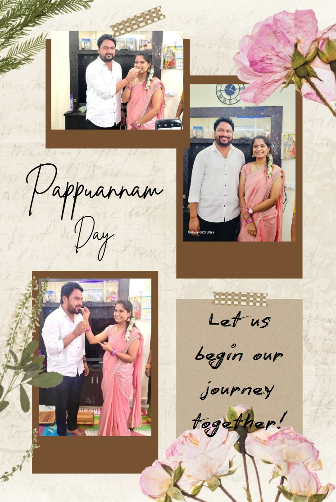
    </a>
    
"It’s our Pappu Annam day! We were two strangers who are now going to spend the rest of our lives together. Our hearts were blank slates, ready to learn about one another, but surprisingly, God made our mentalities exactly the same. As we took this picture, our hearts were beating so fast—perhaps that was the moment our journey truly began."  I Love You my heart💕

  

  

    <a target="_blank" href="firstpicture.jpg">
      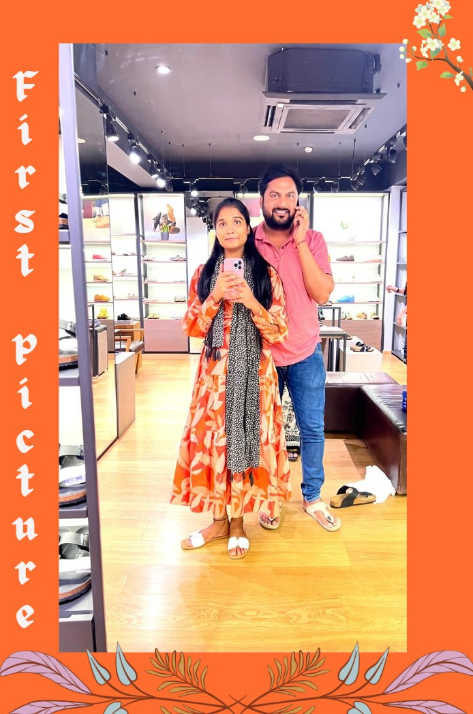
    </a>
    
"This is our very first picture together, taken while we were shopping for our engagement outfits. During that time, I fell deeply in love with you because of the way you showered me with so much love, care, and responsibility. My heart is still racing, and I have butterflies in my stomach just thinking about it."  I Love You my sweetheart😍

  

  

    <a target="_blank" href="firstdate.jpg">
      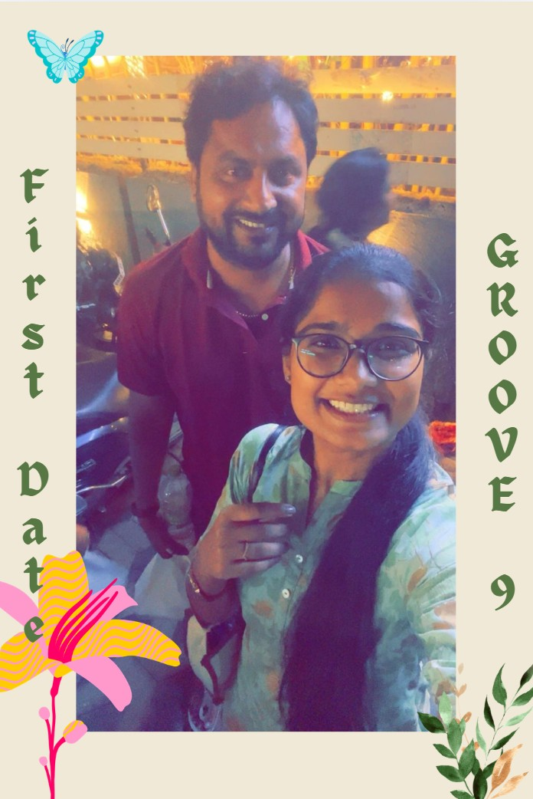
    </a>
    
"I remember our first date at Groove 9 in Sainikpuri. What a coincidence that I had already been there with my B.Tech friends! I remember you sharing your whole life story—from Kabaddi and cricket to bank transfers—while I just sat there, listening to you. It was late into the night, but it remains such a memorable day for me."

  

  

    <a target="_blank" href="engagement.jpg">
      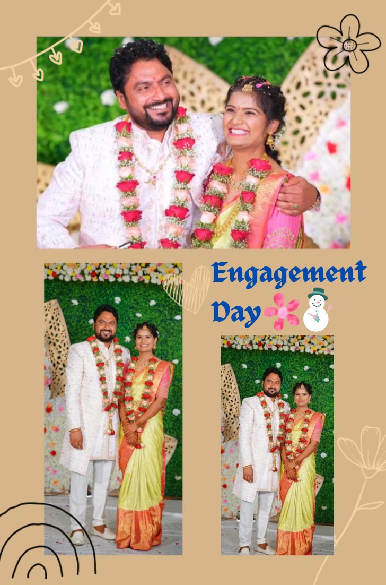
    </a>
    
Add a description of the image here

  

  

    <a target="_blank" href="firstmovie.jpg">
      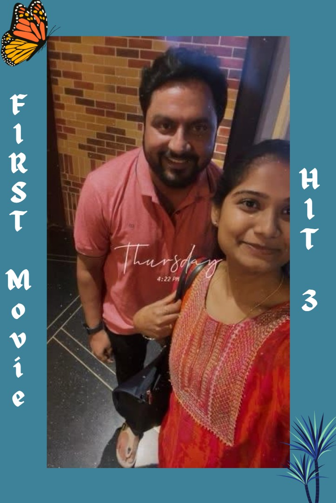
    </a>
    
"This was our very first movie date, watching HIT 3. Surprisingly, the hero and heroine were acting just like us—shyly touching hands and stealing glances at each other. My heart was racing the entire time! Since our engagement was already done, it felt like you were officially my 'half-husband.' The freedom, love, and care you show me are unforgettable. 
	I love you, my hubby! ❤️🥰"

  

  

    <a target="_blank" href="secondmovie.jpg">
      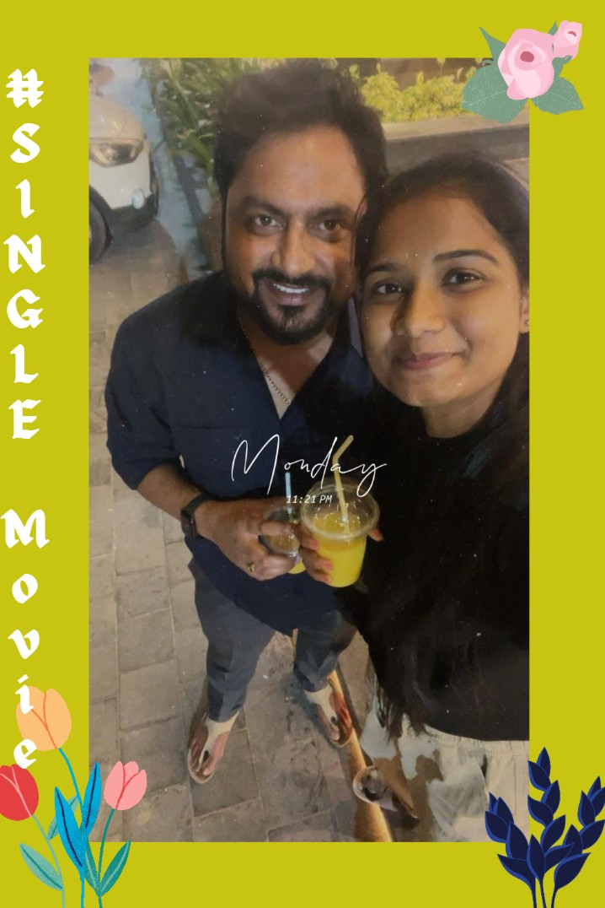
    </a>
    
"This was our second movie date, and with our wedding just four days away, we couldn't resist. We already know we’ll be together for a lifetime, yet our hearts still didn't want to miss a single chance to meet. The best part? We both felt exactly the same way. The movie was called '#Single'—fittingly, the last movie we'll ever watch while still being single! 🤗😜"

  

  

    <a target="_blank" href="wedding.jpg">
      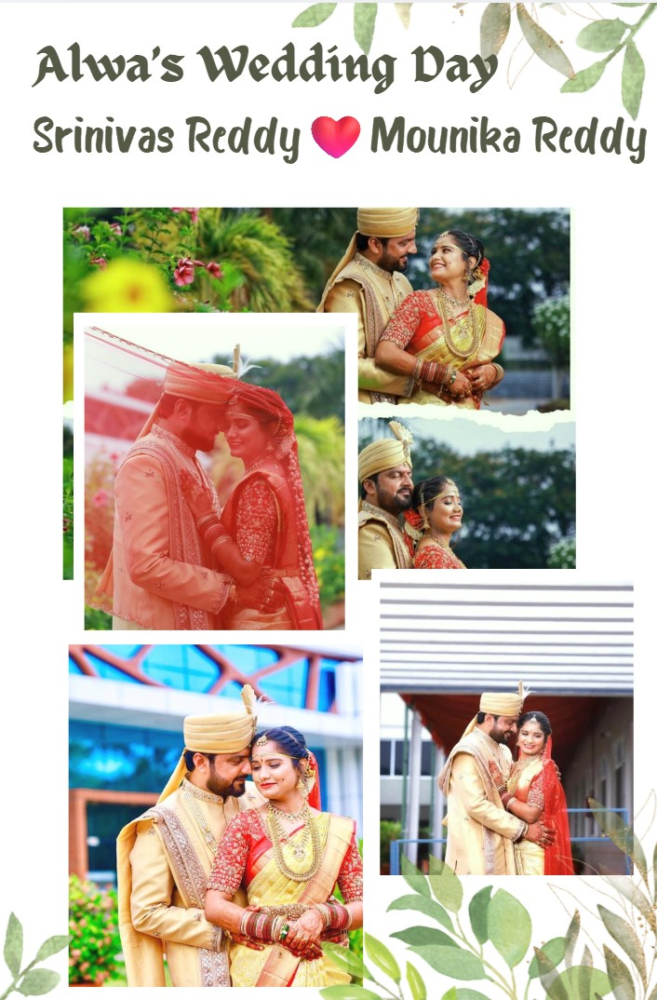
    </a>
    
Add a description of the image here

  

  

    <a target="_blank" href="Weddingday.jpg">
      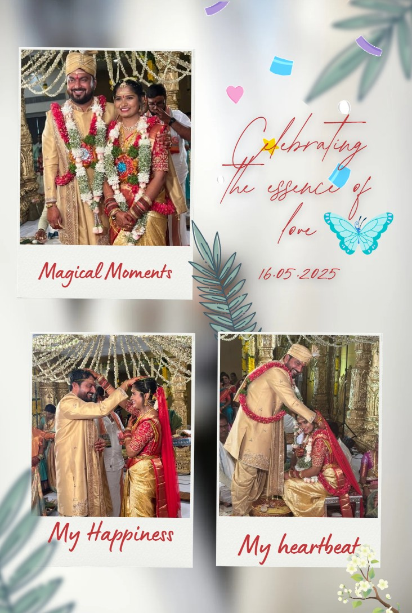
    </a>
    
"Within just one month, we went from Pappannam to our engagement, and now we are married! They say marriages are made in heaven, and our wedding is the perfect example of that. What more could I ask of God? Marriage is the biggest milestone for a girl, and having you in my life is more than enough for this lifetime. To ask for anything more to god would be selfish, because you are now my everything. I may not always express my feelings perfectly, but I love you more than words can say. I promise to never make you unhappy (except for those late nights! 😇). I will cherish, stand by you and honor you until my last breath. You are truly God's gift to me, and I have fallen—and continue to fall—for your love, care, pure soul and responsibility."

  

  

    <a target="_blank" href="nallapusalu.jpg">
      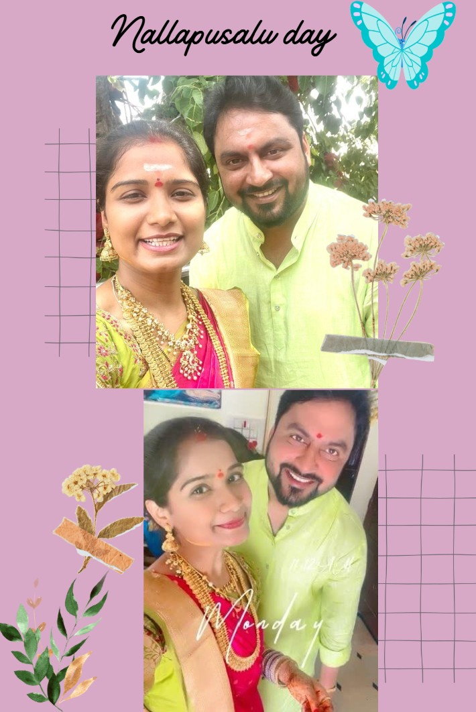
    </a>
    
"It’s our Nalla Pusalu day! I still remember your blessing: 'Nuvvu happy ga undu, nannu happy ga unchu.' I love you so much. I promise to keep you happy until my last breath—except, of course, for those nights when you come home late! I can’t make any promises about my mood then! 😇😂"

  

  

    <a target="_blank" href="firstnight.jpg">
      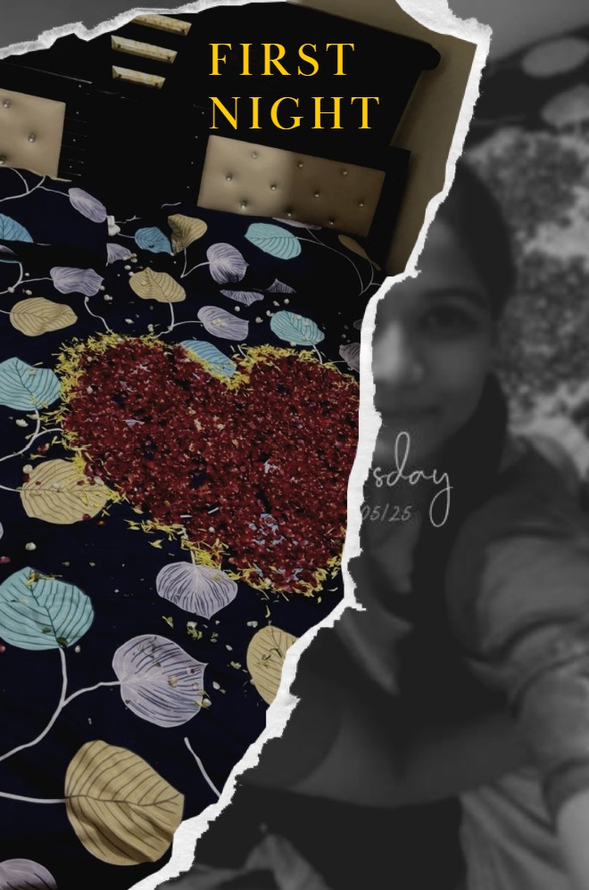
    </a>
    
"It was the 22nd of May, been one week after our wedding. Our two hearts had been waiting for that perfect moment to finally sit and talk about everything under one roof—the kind of talk that could last a lifetime. That day will stay in our memories until our very last breath. 
	I love you, my life! ❤️💚"

  

  

    <a target="_blank" href="Devotional.jpg">
      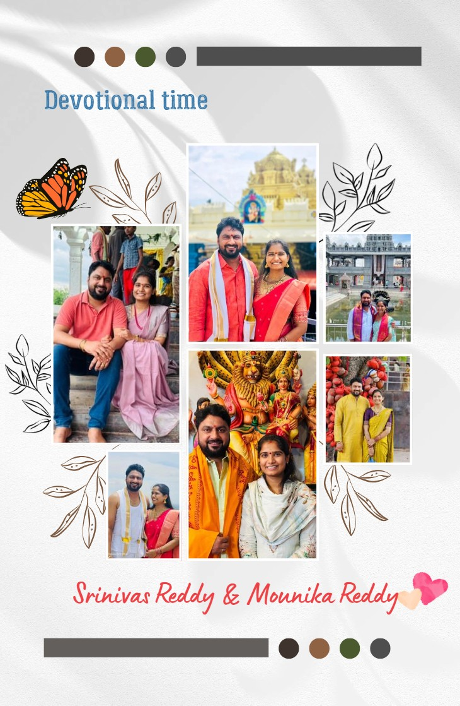
    </a>
    
Add a description of the image here

  

  

    <a target="_blank" href="husbirthday.jpg">
      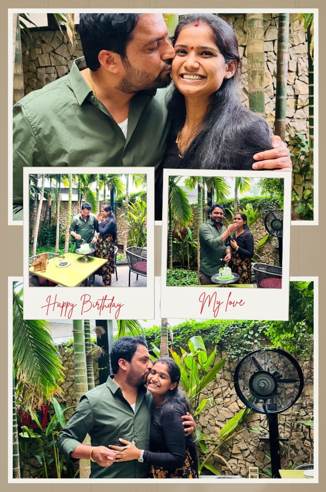
    </a>
    
"On your birthday, I felt as if it were my own! I tried to surprise you in a unique way, and I was so happy that you loved everything I did. I want to fill your life with many more beautiful surprises. The look on your face when you receive something from me is my favorite thing in the world. Here’s to many, many more birthdays to come by my side! 😜💋💋 
	I love you, Kannammaaa! ❤️❤️"

  

  

    <a target="_blank" href="concert.jpg">
      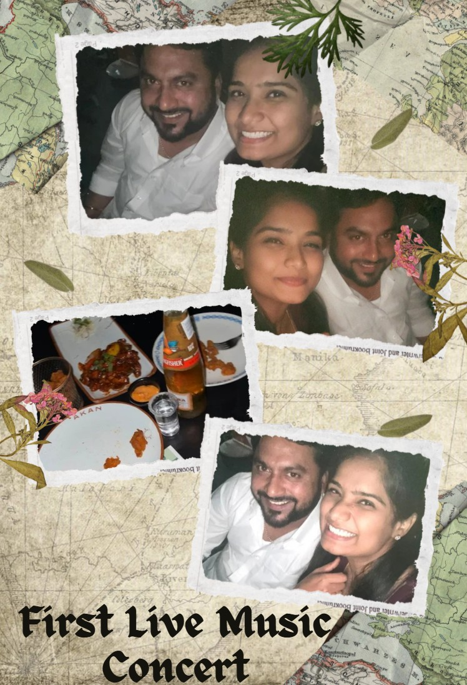
    </a>
    
"Our first big date after the wedding—a live concert! I loved how much you wanted to take me there and how you made sure I enjoyed every single moment. It felt like you were there more for my happiness than your own, and that touched my heart so much. I could feel that you cared more about my enjoyment than anything else. What more could I ask for in life than you? I had the most amazing time with you, and it’s a memory I’ll cherish forever. 
	I love you, my husband! ❤️❤️💋"

  

  

    <a target="_blank" href="bites.jpg">
      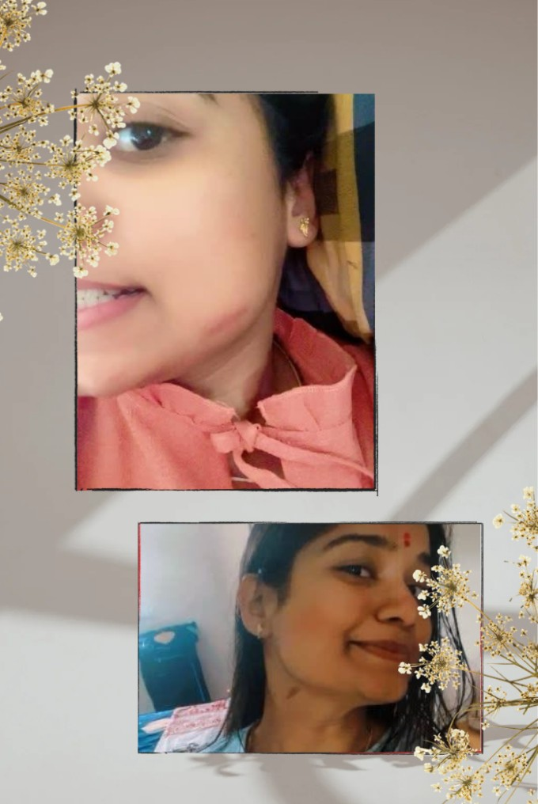
    </a>
    
"I wish for these love bites to never end. I hope that even in our old age, we are still this playful and in love. Whenever I see a bite mark on my face, a smile automatically spreads across my lips. 
	I love you, my Bujjikonda! 👩‍❤️‍💋‍👨"

  

  

    <a target="_blank" href="gorintaku.jpg">
      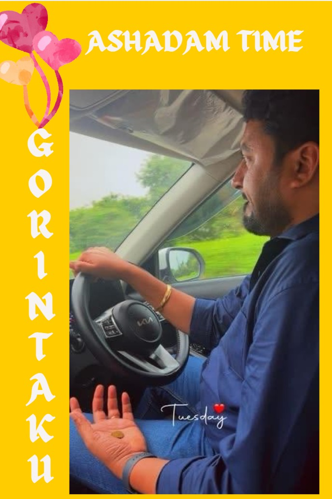
    </a>
    
"It’s Ashadham, the time when everyone adorns their hands with Gorintaku. I felt so happy when you let me apply it to your hand; I love you so much, my better half! 
	I remember we went to the post office that day for your passport. I promise you, we will definitely plan a trip together very soon!"

  

  

    <a target="_blank" href="confirmed.jpg">
      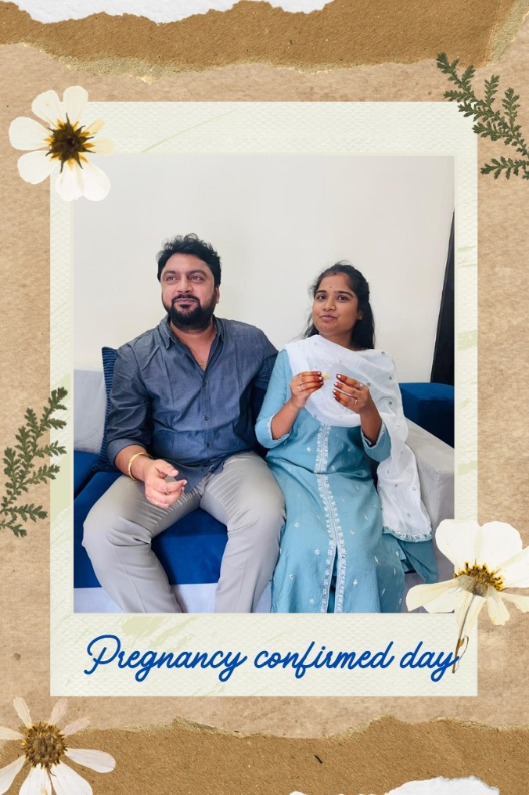
    </a>
    
Add a description of the image here

  

  

    <a target="_blank" href="birthday.jpg">
      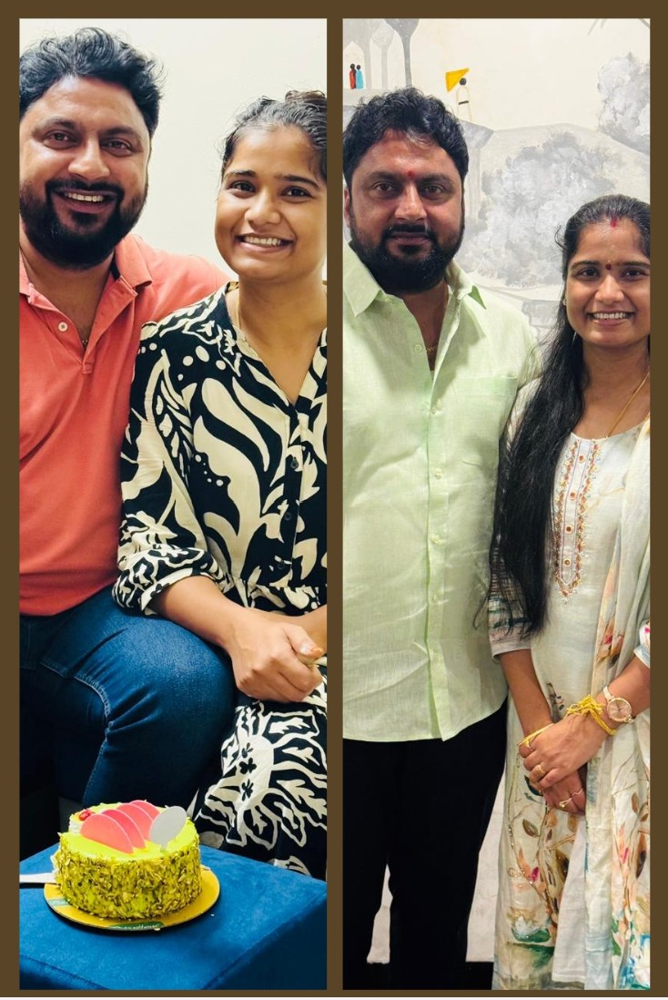
    </a>
    
Add a description of the image here

  

  

    <a target="_blank" href="eachother.jpg">
      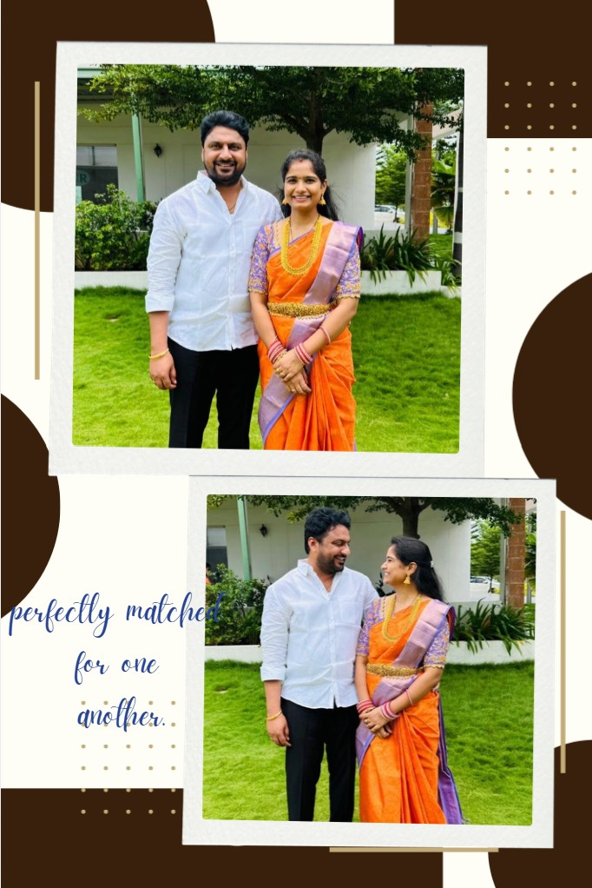
    </a>
    
"In this beautiful picture, we truly look like we were made for each other. Nazar na lage to our bond. ❤️🧿"

  

  

    
    
Add a description of the image here

  

  

    <a target="_blank" href="Maternityy.jpg">
      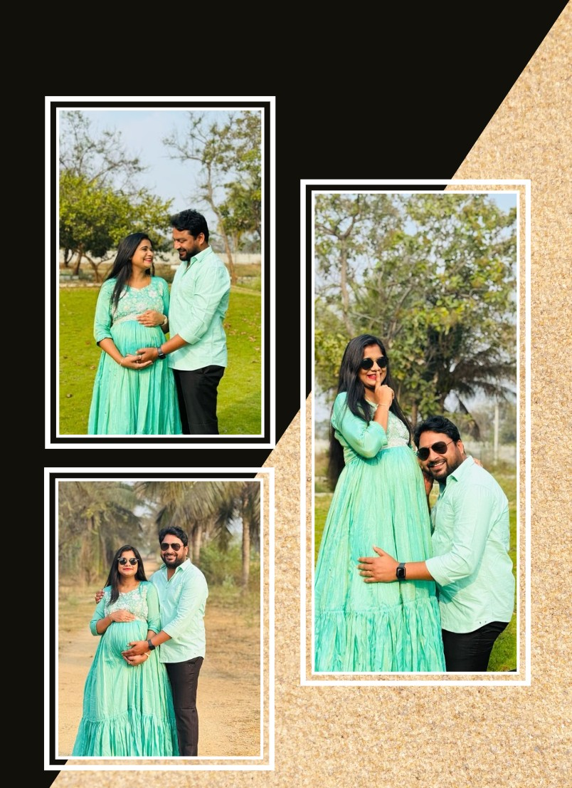
    </a>
    
Add a description of the image here

  

  

    
    
"I bit you because you’ve given me so much freedom—it's as if everything that is mine is yours, and everything yours is mine. And also not giving your mobile as I know there were no secrets in the mobile."

  

  

<!--  <label for="yes_no_radio">Do you agree to the terms?</label>

<input type="radio" name="yes_no" checked>Yes</input>

<input type="radio" name="yes_no">No</input>

-->

<h1 > There is something special waiting for you, will you click on the below button? my husband🥰❤️...</h1>
<a href="other.html" class="button-class">
      Go to Another Page</a>

</body>
</html>
